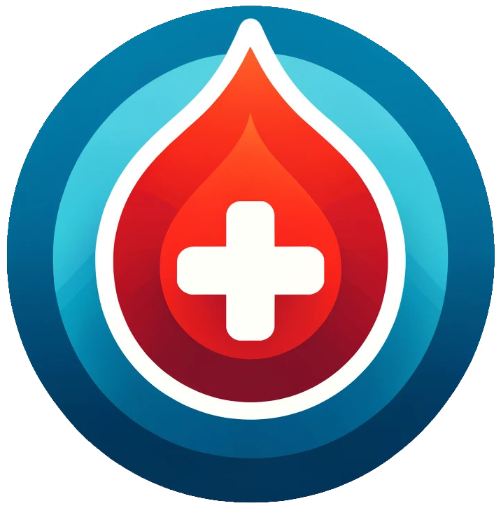

# DiaPrognosis

<p align="center">
  
</p>

<p align="center">
  
  
  
  
  
  
</p>

**DiaPrognosis** adalah aplikasi web chatbot yang dirancang untuk membantu memprediksi diabetes dan memberikan wawasan kesehatan dengan menggunakan teknologi machine learning.

## 📜 Fitur Utama

- 🧬 **Prediksi Diabetes**: Berdasarkan data pengguna seperti usia, BMI, hipertensi, penyakit jantung, riwayat merokok, tingkat HbA1c, dan tingkat glukosa darah.
- 💬 **Antarmuka Chat Interaktif**: Berkomunikasi dengan chatbot yang responsif dan informatif.
- 📚 **Penyimpanan Riwayat Chat**: Melacak percakapan sebelumnya untuk referensi di masa depan.
- 😎 **Respons Chatbot Gaul**: Chatbot yang gaul dan hanya fokus pada topik diabetes.

## 🛠️ Teknologi yang Digunakan

<p align="center">
  
  
  
  
  
  
</p>

## 🚀 Instalasi

Ikuti langkah-langkah berikut untuk menjalankan aplikasi di lingkungan lokal Anda:

1. **Clone repositori ini**:
    ```bash
    git clone https://github.com/GedeOke/DiaPrognosis.git
    cd DiaPrognosis
    ```

2. **Buat virtual environment dan aktifkan**:
    ```bash
    python -m venv env
    source env/bin/activate  # Pada Windows gunakan `env\Scripts\activate`
    ```

3. **Instal dependensi**:
    ```bash
    pip install -r requirements.txt
    ```

4. **Jalankan aplikasi**:
    ```bash
    flask run
    ```

Aplikasi akan berjalan pada `http://127.0.0.1:5000`.

## 📋 Panduan Penggunaan

1. **Buka halaman utama** pada `http://127.0.0.1:5000/`.
2. **Masukkan pesan** pada form untuk memulai percakapan dengan chatbot.
3. **Ikuti instruksi chatbot** untuk memasukkan data yang diperlukan untuk prediksi diabetes.
4. **Chatbot akan memberikan hasil prediksi** dan wawasan kesehatan berdasarkan data yang Anda berikan.

## 🤝 Kontribusi

Kontribusi selalu diterima! Silakan buat `issue` untuk melaporkan bug atau permintaan fitur, dan `pull request` untuk kontribusi kode. 

1. Fork repositori ini
2. Buat branch fitur Anda (`git checkout -b fitur-Anda`)
3. Commit perubahan Anda (`git commit -m 'Menambahkan fitur X'`)
4. Push ke branch (`git push origin fitur-Anda`)
5. Buat Pull Request

## 📝 Lisensi

Proyek ini dilisensikan di bawah [MIT License](LICENSE).

## 🙏 Kredit

Dikembangkan oleh Team 14 untuk Massive Project dari Infinite Learning.

## 📎 Tautan

- [GitHub Repository](https://github.com/GedeOke/DiaPrognosis)
- [Dokumentasi Resmi Flask](https://flask.palletsprojects.com/)
- [Dokumentasi Resmi Tailwind CSS](https://tailwindcss.com/)

<p align="center">
  
</p>
